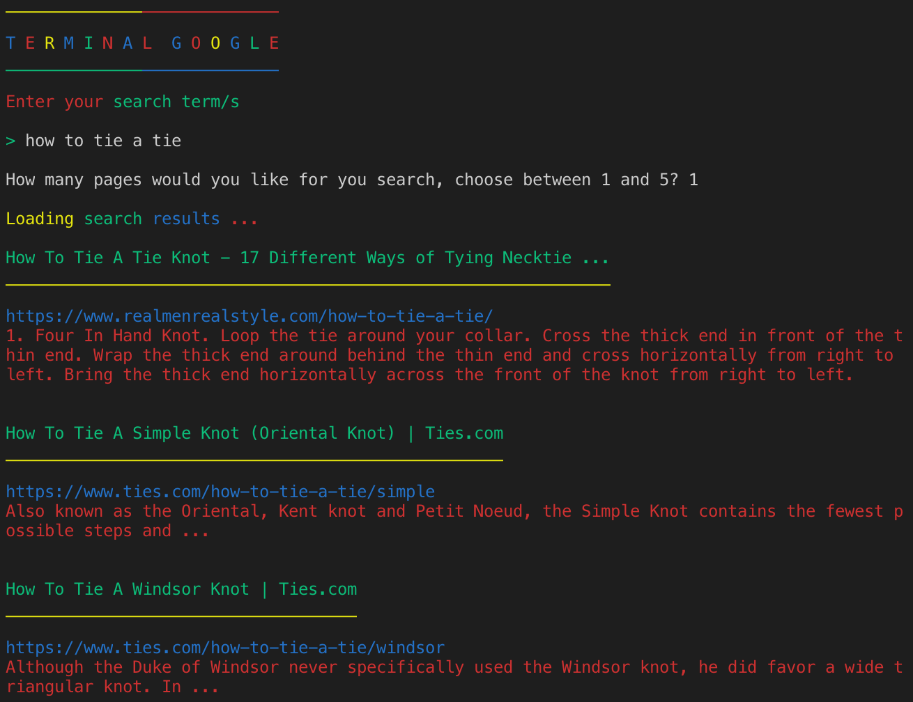

# Toogle

Take your traditional google searching "DOWN" a level by using 'Terminal Google' aka 'Toogle'. With this gem, you can get only the most relevant results for your 'google' search "who cares about a page 100,000". When using this gem it will be color coded using red/green/blue and yellow. I recommend you use a dark terminal background if you have sensitive eyes.

## Installation

Add this line to your application's Gemfile:

```ruby
gem 'toogle'
```

And then execute:

    $ bundle

Or install it yourself as:

    $ gem install toogle

## Usage

    $ Open up the terminal and just run the program by typing 'toogle' (without the quotes of course)
    
## Sample Image


    
## Development

After checking out the repo, run `bin/setup` to install dependencies. Then, run `rake spec` to run the tests. You can also run `bin/console` for an interactive prompt that will allow you to experiment.

To install this gem onto your local machine, run `bundle exec rake install`. To release a new version, update the version number in `version.rb`, and then run `bundle exec rake release`, which will create a git tag for the version, push git commits and tags, and push the `.gem` file to [rubygems.org](https://rubygems.org).

## Contributing

Bug reports and pull requests are welcome on GitHub at https://github.com/[USERNAME]/toogle. This project is intended to be a safe, welcoming space for collaboration, and contributors are expected to adhere to the [Contributor Covenant](http://contributor-covenant.org) code of conduct.

## License

The gem is available as open source under the terms of the [MIT License](https://opensource.org/licenses/MIT).

## Code of Conduct

Everyone interacting in the Toogle project’s codebases, issue trackers, chat rooms and mailing lists is expected to follow the [code of conduct](https://github.com/[USERNAME]/toogle/blob/master/CODE_OF_CONDUCT.md).
